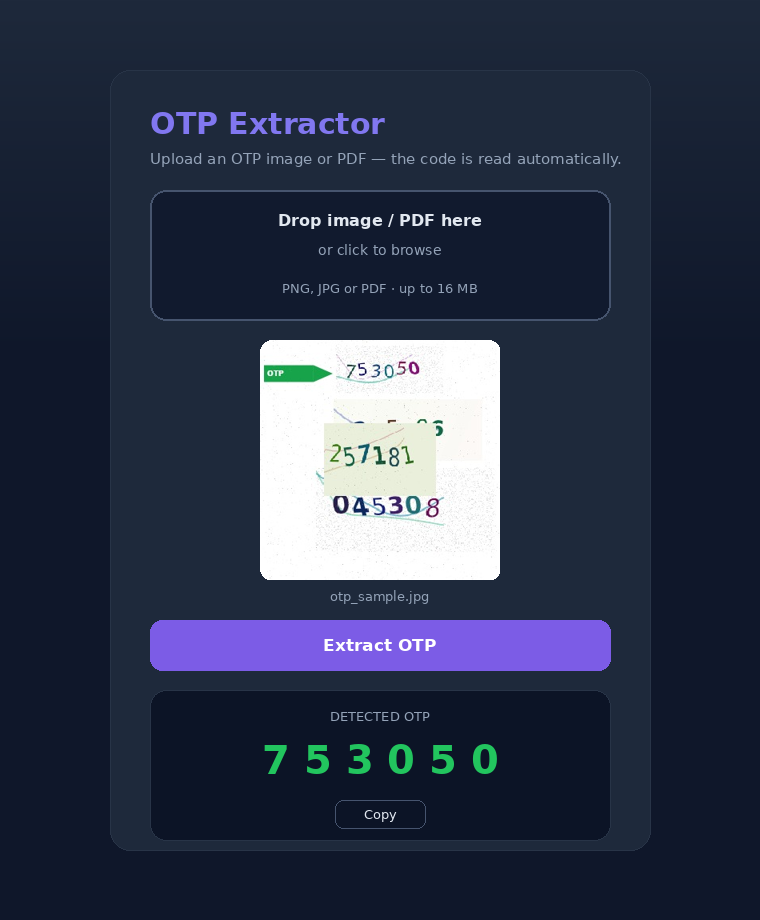

# OTP Extractor

Automation that reads a One-Time-Password (OTP) out of an image or PDF using
OCR. Built to slot into an email pipeline: when an OTP email arrives with a
screenshot/PDF, this reads the code automatically — no manual typing.

## Features

- Extracts the OTP from a noisy image even when several decoy numbers are
  present, by locating the **OTP** label/arrow and picking the nearest code.
- Reads codes straight from a PDF (pulls embedded images via PyMuPDF).
- Optional `--crop x,y,w,h` override for fixed-layout screenshots.
- Clean web UI for drag-and-drop testing and visualisation.

## Setup

```bash
# System dependency (OCR engine)
sudo apt-get install -y tesseract-ocr          # Linux
# macOS:   brew install tesseract
# Windows: install the UB Mannheim build, then either add its folder to PATH
#          or set TESSERACT_CMD to the tesseract.exe path. By default the app
#          auto-detects C:\Program Files\Tesseract-OCR\tesseract.exe.

# Python dependencies
pip install -r requirements.txt
```

## Usage

### Command line

```bash
python extract_otp.py path/to/image.jpg          # image -> prints OTP
python extract_otp.py --pdf path/to/email.pdf    # PDF  -> prints OTP
python extract_otp.py image.jpg --crop 100,10,110,50
```

Prints the OTP to stdout (exit 0), or `No OTP found` to stderr (exit 1) — easy
to capture from a shell pipeline or `subprocess`.

### Web UI

```bash
python app.py
# open http://localhost:5000
```



## How it works

1. Run OCR (`pytesseract`, sparse-text mode) over the image.
2. Collect every 4–8 digit candidate.
3. Find the **OTP** / arrow label and pick the digit group nearest to it
   (with a rightward / same-row bias to follow the arrow).
4. Fall back to the single / top-most candidate, or a preprocessed
   (grayscale → upscale → denoise → threshold) pass for low-contrast images.

## Project layout

```
extract_otp.py        Core extraction logic + CLI
app.py                Flask app (/extract, /inspect) + static hosting
static/               Dashboard frontend (index.html, styles.css, app.js, config.js)
benchmark_accuracy.py Accuracy harness (needs a local data/ folder of test images)
tests/fixtures/       Sample OTP image and Gmail PDF
Dockerfile            Backend image (bundles the Tesseract binary)
render.yaml           Render blueprint (Docker web service)
vercel.json           Vercel static-frontend config
```

## Deploy

The backend needs the **Tesseract binary** + OpenCV libs, so it ships as a
Docker image. Frontend is plain static files.

**Backend → Render (Docker):**
1. Push this repo to GitHub.
2. Render → New → Blueprint → select the repo (`render.yaml` is detected).
3. Deploy. Note the URL, e.g. `https://otp-extractor-api.onrender.com`.

**Frontend → Vercel (static):**
1. Vercel → New Project → import the repo; set **Root Directory** to `static`.
2. Edit `static/config.js` → set `apiBase` to your Render URL (so the UI calls
   the backend cross-origin; CORS is already enabled for `/extract` and `/inspect`).
3. Deploy.

To run the whole thing from one host, deploy only the Render service and leave
`apiBase` as `""` — Render serves the frontend too.
